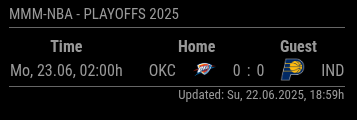

# MMM-NBA

<p style="text-align: center">
    <a href="https://choosealicense.com/licenses/mit"></a>
</p>

This module is an extention for the [MagicMirror](https://github.com/MichMich/MagicMirror).

The module is based on the work of [bgibz](https://github.com/bgibz/MMM-NBA) and got extended by some ideas of the module of [jclarke0000](https://github.com/jclarke0000/MMM-MyScoreboard) and [fewieden](https://github.com/fewieden/MMM-NHL).

## Screenshot



## Installation

Open a terminal session, navigate to your MagicMirror's `modules` folder and execute `git clone https://github.com/jupadin/MMM-NBA.git`, such that a new folder called MMM-NBA will be created.

Activate the module by adding it to the `config.js` file of the MagicMirror as shown below.

The table below lists all possible configuration options.

````javascript
cd modules
git clone https://github.com/jupadin/MMM-NBA.git
cd MMM-NBA
npm install
````

## Using the module
````javascript
    modules: [
        {
            module: "MMM-NBA",
            header: "MMM-NBA",
            position: "top_left",
            config: {
                animationSpeed: 2000,
                updateInterval: 3600000,
                updateIntervalLive: 6000,
                colored: true,
                focus_on: false,
                timeFormat: "dd. HH:mm",
                showHeaderAsIcons: false,
                showFooter: true,
            }
        }
    ]
````

## Configuration options

The following configuration options can be set and/or changed:

### Module

| Option | Type | Default | Description |
| ---- | ---- | ---- | ---- |
| `animationSpeed` | `int` | `2000` | Animation speed to fade in the module on startup [milliseconds] (2 seconds) |
| `updateInterval` | `int` | `3600000` | How often the table shall be updated while there is *no* live game [milliseconds] (1 hour) |
| `updateIntervalLive` | `int` | `6000` | How often the table shall be updated while there is at least one live game [milliseconds] (1 minute) |
| `colored` | `bool` | `true` | Remove black/white filter of logos |
| `focus_on` | `array` | `false`| Highlight matches with teams of this array and also show bye weeks for these teams (example: `['CHI']`) |
| `timeFormat` | `string` | `'dd. HH:mm'` | Displays the time of the upcoming events in the given format |
| `showHeaderAsIcons`| `bool` |`false` | Display header as icons |
| `showFooter` | `bool` | `true` | Display footer with information about last update |